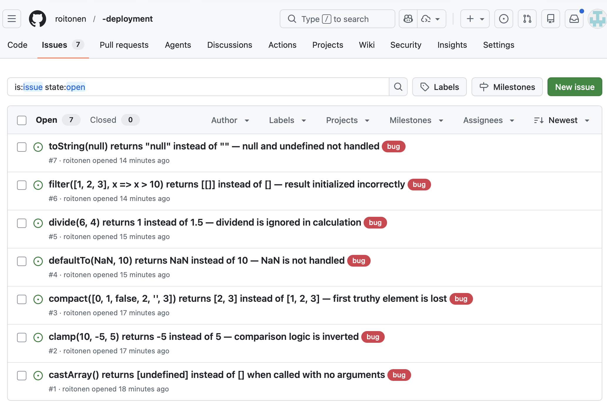

# Software Testing Assignment — LAB University of Applied Sciences

[](https://coveralls.io/github/roitonen/-deployment?branch=main)

## Overview

This repository contains unit tests for the AT00CK37-3003 library. The tests are implemented using **Mocha** and **Chai**, with coverage reporting via **c8** and **Coveralls**.

---

## Project Structure

```
.
├── LICENSE
├── README.md
├── package-lock.json
├── package.json
├── src/                        # Source library files (under test)
│   ├── LICENSE                 # Must NOT be removed!
│   ├── .internal/              # Internal helpers — NOT tested
│   ├── add.js
│   ├── at.js
│   ├── camelCase.js
│   ├── capitalize.js
│   ├── castArray.js
│   ├── ceil.js
│   ├── chunk.js
│   └── ...
└── tests/
    └── test.js                 # All unit tests
```

---

## Implementation Approach

### Tools Used

| Tool                     | Purpose            |
| ------------------------ | ------------------ |
| **Mocha**          | Test runner        |
| **Chai**           | Assertion library  |
| **c8**             | Code coverage      |
| **Coveralls**      | Coverage reporting |
| **GitHub Actions** | CI/CD pipeline     |

### Why Mocha + Chai

Mocha and Chai were chosen because they are a well-established combination for JavaScript testing, providing clear and readable test output and flexible assertion styles.

### Testing Approach

- Tests are written for public API functions in `src/`
- The `src/.internal/` directory is **excluded** from testing as per assignment requirements
- Each function has multiple test cases covering normal behavior, edge cases, and boundary values
- Tests are written to reflect **expected correct behavior** — if a function has a bug, the test fails and clearly shows what went wrong

---

## Files Tested

| File                     | Tested        | Notes              |
| ------------------------ | ------------- | ------------------ |
| `castArray.js`         | ✅            | Bug found          |
| `clamp.js`             | ✅            | Bug found          |
| `compact.js`           | ✅            | Bug found          |
| `defaultTo.js`         | ✅            | Bug found          |
| `defaultToAny.js`      | ✅            |                    |
| `divide.js`            | ✅            | Bug found          |
| `drop.js`              | ✅            |                    |
| `endsWith.js`          | ✅            |                    |
| `eq.js`                | ✅            |                    |
| `every.js`             | ✅            |                    |
| `filter.js`            | ✅            | Bug found          |
| `isArrayLike.js`       | ✅            |                    |
| `isArrayLikeObject.js` | ✅            |                    |
| `isBoolean.js`         | ✅            |                    |
| `isLength.js`          | ✅            |                    |
| `isObject.js`          | ✅            |                    |
| `isObjectLike.js`      | ✅            |                    |
| `isSymbol.js`          | ✅            |                    |
| `map.js`               | ✅            |                    |
| `memoize.js`           | ✅            |                    |
| `slice.js`             | ✅            |                    |
| `toFinite.js`          | ✅            |                    |
| `toInteger.js`         | ✅            |                    |
| `toNumber.js`          | ✅            |                    |
| `toString.js`          | ✅            | Bug found          |
| `words.js`             | ✅            |                    |
| `capitalize.js`        | ✅            |                    |
| `upperFirst.js`        | ✅ (indirect) | Used by capitalize |

## Files NOT Tested

| File                | Reason                                          |
| ------------------- | ----------------------------------------------- |
| `add.js`          | Depends on `.internal/createMathOperation.js` |
| `at.js`           | Depends on `.internal/baseAt.js`              |
| `camelCase.js`    | Depends on `.internal` modules                |
| `ceil.js`         | Depends on `.internal/createRound.js`         |
| `chunk.js`        | Depends on `.internal` modules                |
| `countBy.js`      | Depends on `.internal` modules                |
| `difference.js`   | Depends on `.internal` modules                |
| `get.js`          | Depends on `.internal/baseGet.js`             |
| `isArguments.js`  | Depends on `.internal/getTag.js`              |
| `isBuffer.js`     | Depends on `.internal/root.js`                |
| `isDate.js`       | Depends on `.internal` modules                |
| `isEmpty.js`      | Depends on `.internal` modules                |
| `isTypedArray.js` | Depends on `.internal` modules                |
| `keys.js`         | Depends on `.internal` modules                |
| `reduce.js`       | Depends on `.internal` modules                |
| `src/.internal/*` | Excluded per assignment requirements            |

---

## CI/CD Pipeline

### GitHub Actions

The pipeline is triggered on every `push` to the repository. It runs on `ubuntu-24.04` with Node.js 22.
See all workflow runs: [GitHub Actions](https://github.com/roitonen/-deployment/actions/)

**Workflow steps:**

1. Checkout repository
2. Set up Node.js 22
3. Install dependencies (`npm install`)
4. Run tests with coverage (`npm run coverage`)
5. Upload coverage report to Coveralls

### Coveralls

Coverage reports are automatically sent to Coveralls after each pipeline run. The badge at the top of this README shows the current coverage percentage.

---

## Running Tests Locally

```bash
# Install dependencies
npm install

# Run tests
npm test

# Run tests with coverage report
npm run coverage
```

---

## Test Results

Total: **127 passing, 12 failing**

The 12 failing tests are **intentional** — they document bugs found in the library. Each failing test clearly shows:

- which function is broken
- what arguments were used
- what was expected vs what was returned

### Local Test Output

```
...

  127 passing (31ms)
  12 failing

  1) castArray
       castArray() with no arguments returns []:
      AssertionError: expected [ undefined ] to deeply equal []

  2) clamp
       clamp(10, -5, 5) returns 5 when value is above upper bound:
      AssertionError: expected -5 to equal 5

  3) clamp
       clamp(3, -5, 5) returns 3 when value is within bounds:
      AssertionError: expected -5 to equal 3

  4) compact
       compact([0, 1, false, 2, "", 3]) returns [1, 2, 3]:
      AssertionError: expected [ 2, 3, '-1': 1 ] to deeply equal [ 1, 2, 3 ]

  5) compact
       compact([1]) returns [1]:
      AssertionError: expected [ , '-1': 1 ] to deeply equal [ 1 ]

  6) defaultTo
       defaultTo(NaN, 10) returns 10 when value is NaN:
      AssertionError: expected NaN to equal 10

  7) divide
       divide(6, 4) returns 1.5:
      AssertionError: expected 1 to equal 1.5

  8) divide
       divide(10, 2) returns 5:
      AssertionError: expected 1 to equal 5

  9) divide
       divide(9, 3) returns 3:
      AssertionError: expected 1 to equal 3

  10) filter
       filter([1, 2, 3], x => x > 10) returns [] when no elements match:
      AssertionError: expected [ [] ] to deeply equal []

  11) toString
       toString(null) returns empty string:
      AssertionError: expected 'null' to equal ''

  12) toString
       toString(undefined) returns empty string:
      AssertionError: expected 'undefined' to equal ''
```

### Coverage

```
----------------------|---------|----------|---------|---------|
File                  | % Stmts | % Branch | % Funcs | % Lines |
----------------------|---------|----------|---------|---------|
All files             |   64.88 |    86.08 |   65.11 |   64.88 |
 add.js               |       0 |        0 |       0 |       0 |
 at.js                |       0 |        0 |       0 |       0 |
 camelCase.js         |       0 |        0 |       0 |       0 |
 capitalize.js        |     100 |      100 |     100 |     100 |
 castArray.js         |     100 |      100 |     100 |     100 |
 ceil.js              |       0 |        0 |       0 |       0 |
 chunk.js             |       0 |        0 |       0 |       0 |
 clamp.js             |     100 |    88.88 |     100 |     100 |
 compact.js           |     100 |      100 |     100 |     100 |
 countBy.js           |       0 |        0 |       0 |       0 |
 defaultTo.js         |     100 |      100 |     100 |     100 |
 defaultToAny.js      |     100 |      100 |     100 |     100 |
 difference.js        |       0 |        0 |       0 |       0 |
 divide.js            |     100 |      100 |     100 |     100 |
 drop.js              |     100 |      100 |     100 |     100 |
 endsWith.js          |     100 |      100 |     100 |     100 |
 eq.js                |     100 |      100 |     100 |     100 |
 every.js             |     100 |      100 |     100 |     100 |
 filter.js            |     100 |       80 |     100 |     100 |
 get.js               |       0 |        0 |       0 |       0 |
 isArguments.js       |       0 |        0 |       0 |       0 |
 isArrayLike.js       |     100 |      100 |     100 |     100 |
 isArrayLikeObject.js |     100 |      100 |     100 |     100 |
 isBoolean.js         |     100 |       80 |     100 |     100 |
 isBuffer.js          |       0 |        0 |       0 |       0 |
 isDate.js            |       0 |        0 |       0 |       0 |
 isEmpty.js           |       0 |        0 |       0 |       0 |
 isLength.js          |     100 |      100 |     100 |     100 |
 isObject.js          |     100 |      100 |     100 |     100 |
 isObjectLike.js      |     100 |      100 |     100 |     100 |
 isSymbol.js          |     100 |      100 |     100 |     100 |
 isTypedArray.js      |       0 |        0 |       0 |       0 |
 keys.js              |       0 |        0 |       0 |       0 |
 map.js               |     100 |      100 |     100 |     100 |
 memoize.js           |     100 |    84.61 |     100 |     100 |
 reduce.js            |       0 |        0 |       0 |       0 |
 slice.js             |     100 |    94.73 |     100 |     100 |
 toFinite.js          |     100 |    91.66 |     100 |     100 |
 toInteger.js         |     100 |      100 |     100 |     100 |
 toNumber.js          |    92.3 |    81.25 |     100 |    92.3 |
 toString.js          |   95.23 |    84.61 |     100 |   95.23 |
 upperFirst.js        |     100 |      100 |     100 |     100 |
 words.js             |     100 |      100 |     100 |     100 |
----------------------|---------|----------|---------|---------|
```

Coverage exceeds the required **60%** threshold.

---

## Bug Reports

The following bugs were found during testing. Each bug is reported as a GitHub Issue with a detailed description, steps to reproduce, expected vs actual behavior, and root cause analysis.

See all issues: [GitHub Issues](https://github.com/roitonen/-deployment/issues)



Each issue contains a full bug report with steps to reproduce, expected vs actual behavior, and root cause analysis. Click on any issue title in the table below to view the full report on GitHub.

| # | File             | Issue                                                                                                                                                         |
| - | ---------------- | ------------------------------------------------------------------------------------------------------------------------------------------------------------- |
| 1 | `castArray.js` | [castArray() with no arguments returns [undefined] instead of []](https://github.com/roitonen/-deployment/issues/1)                                              |
| 2 | `clamp.js`     | [clamp(10, -5, 5) returns -5 instead of 5 — comparison logic is inverted](https://github.com/roitonen/-deployment/issues/2)                                     |
| 3 | `compact.js`   | [compact([0, 1, false, 2, &#39;&#39;, 3]) returns [2, 3] instead of [1, 2, 3] — first truthy element is lost](https://github.com/roitonen/-deployment/issues/3) |
| 4 | `defaultTo.js` | [defaultTo(NaN, 10) returns NaN instead of 10 — NaN is not handled](https://github.com/roitonen/-deployment/issues/4)                                           |
| 5 | `divide.js`    | [divide(6, 4) returns 1 instead of 1.5 — dividend is ignored in calculation](https://github.com/roitonen/-deployment/issues/5)                                  |
| 6 | `filter.js`    | [filter([1, 2, 3], x =&gt; x &gt; 10) returns [[]] instead of [] — result initialized incorrectly](https://github.com/roitonen/-deployment/issues/6)            |
| 7 | `toString.js`  | [toString(null) returns &#34;null&#34; instead of &#34;&#34; — null and undefined not handled](https://github.com/roitonen/-deployment/issues/7)                |

---

## Final Verdict

**The library is NOT ready for production.**

The following critical issues were found:

- **`divide.js`** is completely broken — it always returns `1` regardless of input
- **`clamp.js`** always returns the wrong value — the core logic is inverted
- **`compact.js`** silently drops the first element of every result
- **`filter.js`** returns incorrect results when no elements match
- **`defaultTo.js`** does not handle `NaN` as documented
- **`toString.js`** does not handle `null`/`undefined` as documented
- **`castArray.js`** does not handle the no-argument case as documented

7 out of 27 tested files contain bugs. Several of these are fundamental logic errors, not edge cases. The library requires fixes and re-testing before it can be considered production-ready.
